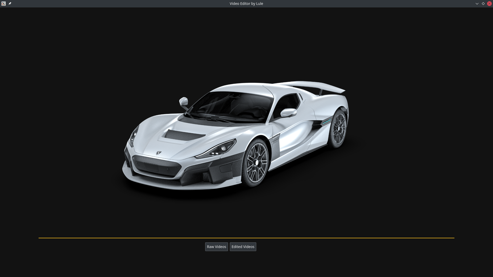

# Qt Video Browser & After Effects Application



You can see example of this application here: https://youtu.be/YCnk2AS-3to
<br>Time needed for finishing this assignment is 48 working hours.

# What is this? :book:
This is a `QtQuick` (Qt5/QML) application which is part of assignment for Software Engineer role at Rimac-automobili, represents a small video editor for the `Linux Ubuntu` operating system.
User can add several overlays to the video:
- Numerical value Text element 
- Basic shape element with applied gradient
- Slider (progress bar)

# Requirements & Build :wrench: 
- Cpp version c++17
- Qt Version 5.15
<br>To be able to start this application on your computer, you should have installed `Linux Ubuntu` operating system. Required packages (Qt libraries) can be installed by running `installRequirements.sh` bash script. To be able to execute this script, you should give it executable permissions. This can be done with command:
```
chmod +x installRequirements.sh 
```
After that, script can be run in terminal with command: 
```
./installRequirements.sh
```
After all packages from the script are installed, application can be built by executing `run.sh` script. This script also should have executable permissions.

# How is it implemented? :brain:
Main idea is to create and save image for each frame, then these images can be easily manipulated.
On each frame we are storing image which has one of overlays added. After that `ffmpeg` is used for creating video from frame images, also audio is copied from original video file. How is done that:
```
ffmpeg -y -framerate 60 -i frameImagesPath -i audioPath -c copy -map 0:v? -map 1:a? -shortest output.mp4
```
For connection between `c++` and `QML` is used `DataBridge` singleton which stores all settings parameters for each overlay and also some other helper functions. Main reason why is that class singleton is that because it's easier to request instance of that main object instead of sending that instance through constructors of other classes.

# Extra features added :gem: 
- Added support for keyboard keys when we play video in full screen:
    - seek video forward 5s `right`
    - seek video back 5s `left`
    - volume increase `up`
    - volume decrease `down`
    - play/pause video `space`
    - close video `esc`
    
- Added support for deleting edited videos

# Improvements :rocket:
- Should be considered creating video without using ffmpeg
- Some edge cases should be covered when we select `x` and `y` coordinates for each overlay
- Better handling with opening and closing QML components

# System :computer:
- Operating System: Kubuntu 21.04
- KDE Plasma Version: 5.21.4
- KDE Frameworks Version: 5.80.0
- Qt Version: 5.15.2
- Kernel Version: 5.11.0-38-generic
- OS Type: 64-bit
- Graphics Platform: X11
- Processors: 8 × Intel® Core™ i7-2670QM CPU @ 2.20GHz
- Memory: 7,7 GiB of RAM
- Graphics Processor: GeForce GT 525M/PCIe/SSE2
